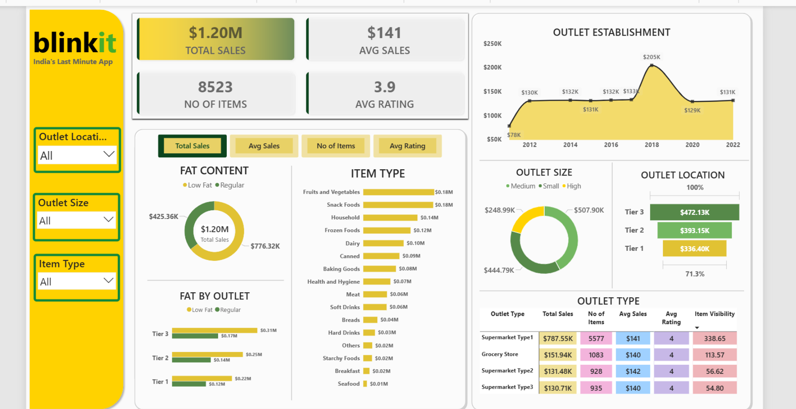

# 🛒 Blinkit Grocery Sales Dashboard

An interactive sales dashboard built using **Microsoft Excel** and **Power BI** to analyze Blinkit's sales performance across different outlets, item categories, and locations.

---

## 📊 Dashboard Preview

---

## 📌 Project Overview

This project involves cleaning and transforming raw grocery sales data using **Power Query** in Excel, and building an interactive dashboard in **Power BI** to uncover key business insights.

---

## 🔍 Key Insights

- 💰 **Total Sales:** $1.20M
- 🧾 **Average Sales:** $141
- 📦 **Total Items:** 8,523
- ⭐ **Average Rating:** 3.9
- 🏆 **Tier 3 outlets** lead in revenue with **$472K**
- 🏪 **Supermarket Type 1** dominates with **$787K** in total sales
- 🥦 **Fruits & Vegetables** and **Snack Foods** are the top-selling categories
- 📈 Sales peaked in **2018 at $205K**

---

## 🛠️ Tools Used

| Tool | Purpose |
|------|---------|
| Microsoft Excel | Data cleaning and preparation |
| Power Query | ETL — Extract, Transform, Load |
| Power BI | Dashboard and data visualization |

---

## 📁 Files in this Repository

| File | Description |
|------|-------------|
| `Blinkit_Dashboard.pbix` | Power BI dashboard file |
| `Blinkit_Data.xlsx` | Cleaned Excel data file |
| `Blinkit_Screenshot.png` | Dashboard preview image |
| `README.md` | Project documentation |

---

## 🚀 How to Use

1. Download the `Blinkit_Data.xlsx` file
2. Open `Blinkit_Dashboard.pbix` in **Power BI Desktop**
3. Refresh the data connection if needed
4. Use the slicers (Outlet Location, Outlet Size, Item Type) to explore insights

---

## 👩‍💻 About me

**A Vinitha Sree**  
B.Tech Computer Science | Data Analyst Learner  
📧 vinithasree04@gmail.com  
🔗 [GitHub](https://github.com/Vinithasree04)
